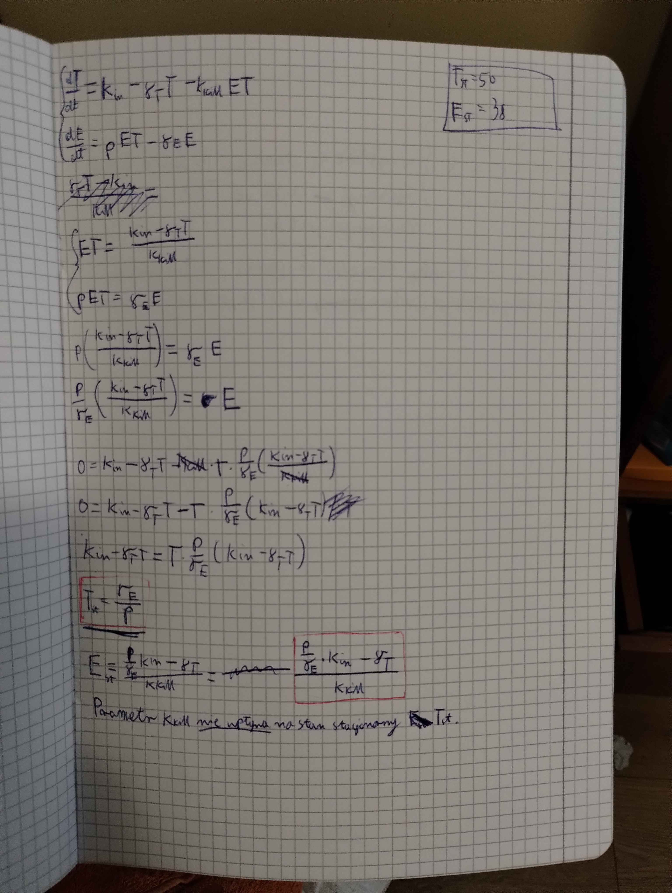
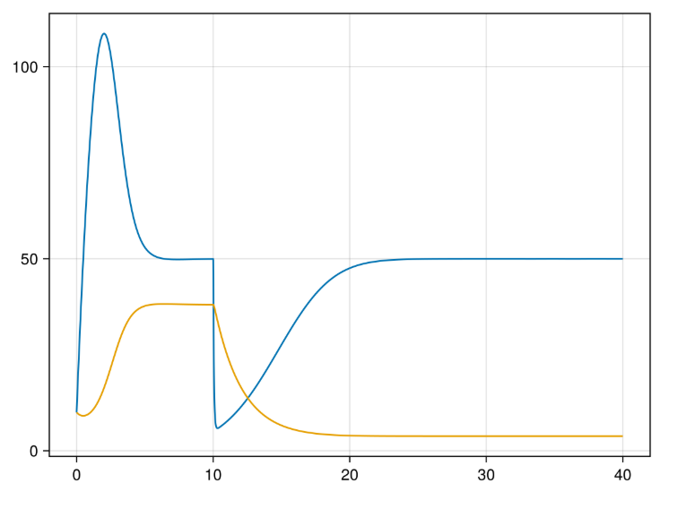
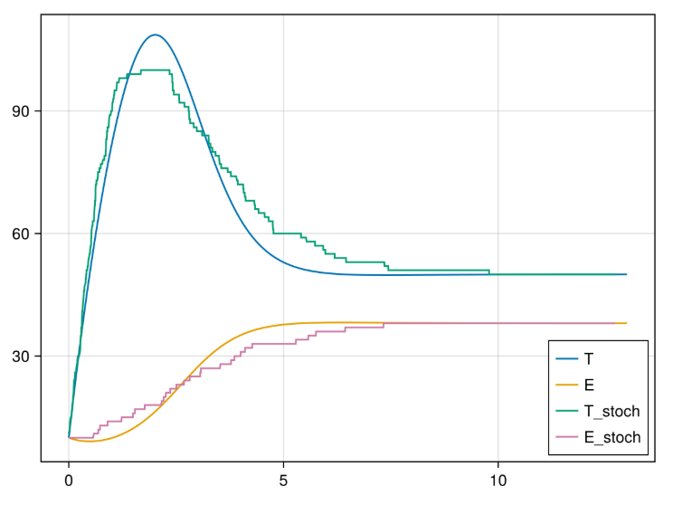
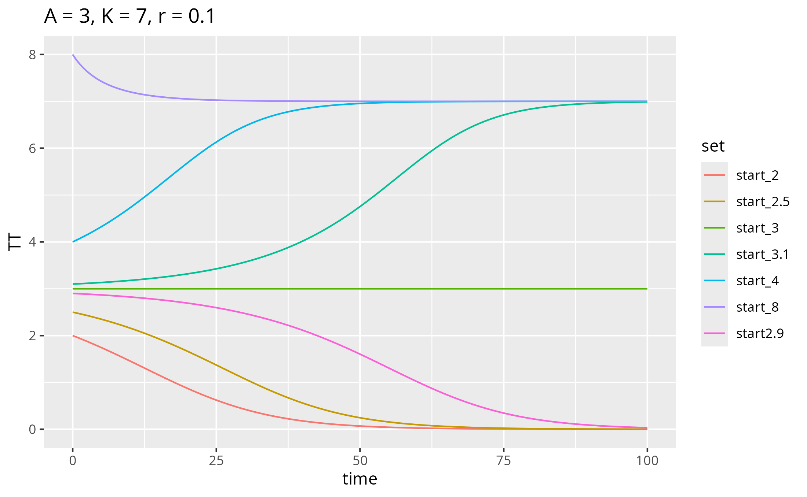
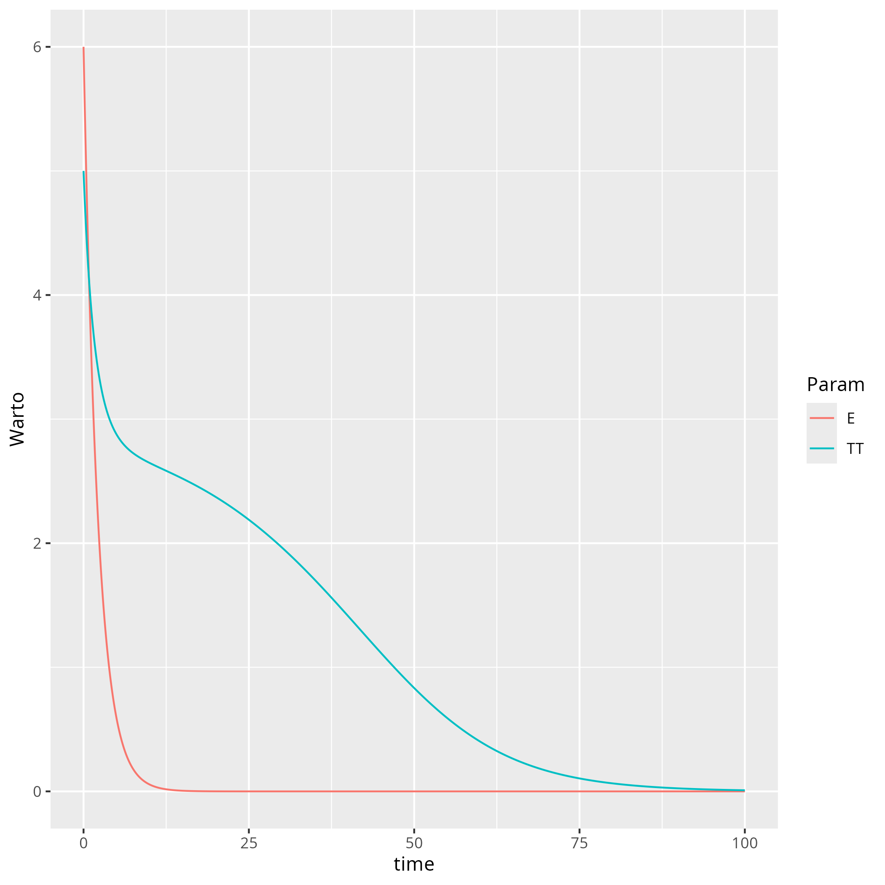
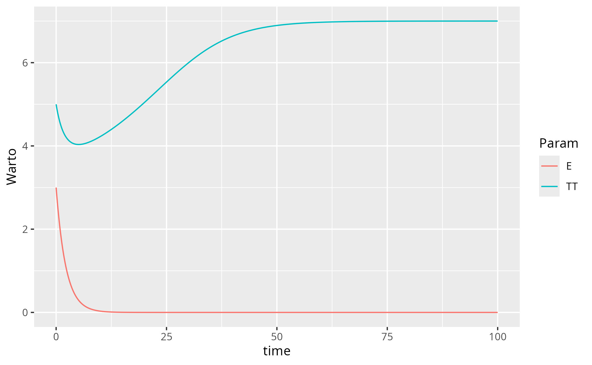

# Biologia Systemów Zestaw Zadań Zaliczeniowych (ZZZ)
## Zadanie 1
Stan stacjonarny:

Parameter k_kill nie wpływa na stan stacjonarny komórek T. Jak widać na wykresie poniżej, dla t=10 wartość kkill zostaje zmieniona, jednak T wraca do tego samego punktu

## Zadanie 2
Podstawiając wartości pod wyliczone stany stacjonarne otrzymujemy Tst = 50 i Est = 38. Takie wartości widać również na wykresie.
## Zadanie 3
4 stany:
- Synteza T
- Synteza E
- Degradacja T
- Degradacja E
Największą szansę ma synteza T. Reszta parametrów zależy od aktualnego stanu ilości komórek. Na ogół jeśli wziąć wartości ze stanu stacjonarnegp to degradacja T ma dużą szanse, a synteza E i degradacja E mają stosunkowo niskie szanse. Wszystko widać na wykresie.

## Zadanie 4

Znaki pochodnej:

-  0 < T < A -> ujemna
-  T = A -> 0  
-  A < T < K -> dodatnia 
-  T > K -> ujemna 

Stany stacjonarne jak widać:

- 0 < T < A -> 0 
- T = A -> A 
- A < T < K -> K 
- T > K -> K
  
Komórki CAR-T nie muszą doprowadzić do całkowitego wybicia komórek T. Wystarczy aby doprowadzić komórki T do stanu A, wtedy pochodna zmienia znak i komórki T wymierają same z siebie.

